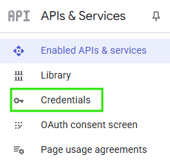
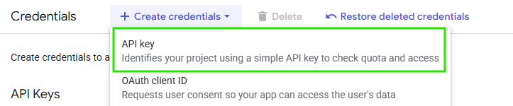
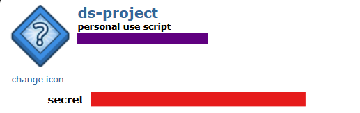

# What political impact does social media have?

## Description
Our project "What political impact does social media have?" **fehlt noch :P**

The seven research questions we worked on are:
1. How has the public perception of anti-vaccine conspiracy via YouTube changed during the last five years? 
2. To what extent do spikes in Wikipedia pageviews related to the AfD align with increases in YouTube video uploads about the party during German federal elections?
3. In what ways has social media contributed to the growth and visibility of the Fridays for Future climate movement? 
4. How did public interest and sentiment in the #MeToo movement evolve over time?
5. How has the perception of Sahra Wagenknecht's presence on social media changed in the past before and after founding her own party?
6. To what extent does the number of social media posts (on YouTube) by political parties influence election results?
7. How has public opinions about the ‘tradwife’ movement evolved since its beginning in 2020?

The answer/code for each question can be found within the according folder (i.e. the answer for the first question is found in 📂 [quest1 folder](./Question1) )
We used LLMs to gather keywords (KeyBERT), filter out stopwords (spaCy) and calculate sentiment (VADER). <br> 
Additionally, we used LLMs to help rewrite and translate text for our website/poster from German to English. <br>
Furthermore, LLMs were used to help with setting up APIs. 


## Getting started

### How to get the API keys
**How to get the YouTube API key:** <br> 
To get an API key for YouTube, you first need a Google account. <br> 
Then you have to visit https://console.developers.google.com/, where you have to create a project. <br> 
After this, navigate to the credentials section. <br> 
 <br> 

Finally, click on create credentials and create an API key. <br> 



**How to get the Reddit API key:** <br>
To get an API key for Reddit, you first need a Reddit account. <br>
You then navigate to https://www.reddit.com/prefs/apps/ and create an app.<br>
Select script in the app choices, and choose a name as well as a redirect uri (you can use http://localhost:8080 as a place holder). <br>
 <br>

Finally, you will find your client_id in the app underneath "personal use script" (purple in picture) <br>
and your client_secret (red in picture), which you both need to access the API. <br>
 <br>


**WikiMedia/WikiPedia API:**<br>
The WikiMedia API does not require an API key. Instead, a header is required that identifies the script (which is given in our code).


### How to install Docker

### How to Start the Website

1. **Start [Docker Desktop](https://www.docker.com/products/docker-desktop/)**  
2. In the terminal, navigate to the project directory:  
    ```bash
    cd newDataDiva/DataDivas/Sonja/Website
    ```
   📂 [Open project folder](./Sonja/Website)  
3. Start the Docker environment (including build):  
    ```bash
    docker compose up --build
    ```
for initial build run: [Windows](/initialStart.bat) or [Linux/Mac](/initialStart.sh)
or run this script instead: [Windows](/start.bat) or [Linux/Mac](/start.sh)

## Authors

## Sources
1. Youtube API - https://developers.google.com/youtube/v3/docs
2. MeToo movement - https://en.wikipedia.org/wiki/MeToo_movement
3. Bundeswahlleiterin - https://www.bundeswahlleiterin.de/
4. Tradwife - https://en.wikipedia.org/wiki/Tradwife
5. Wikimedia API - https://doc.wikimedia.org/generated-data-platform/aqs/analytics-api/
6. List of school climate strikes - https://en.wikipedia.org/wiki/List_of_school_climate_strikes